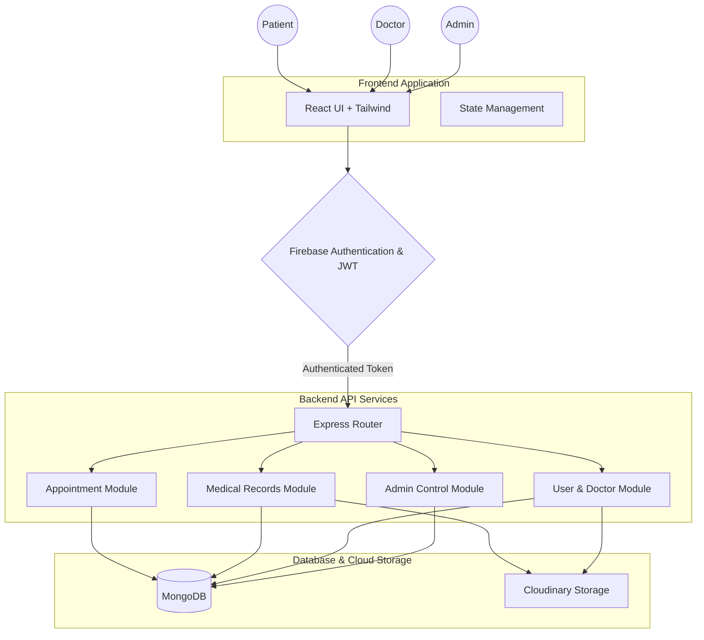
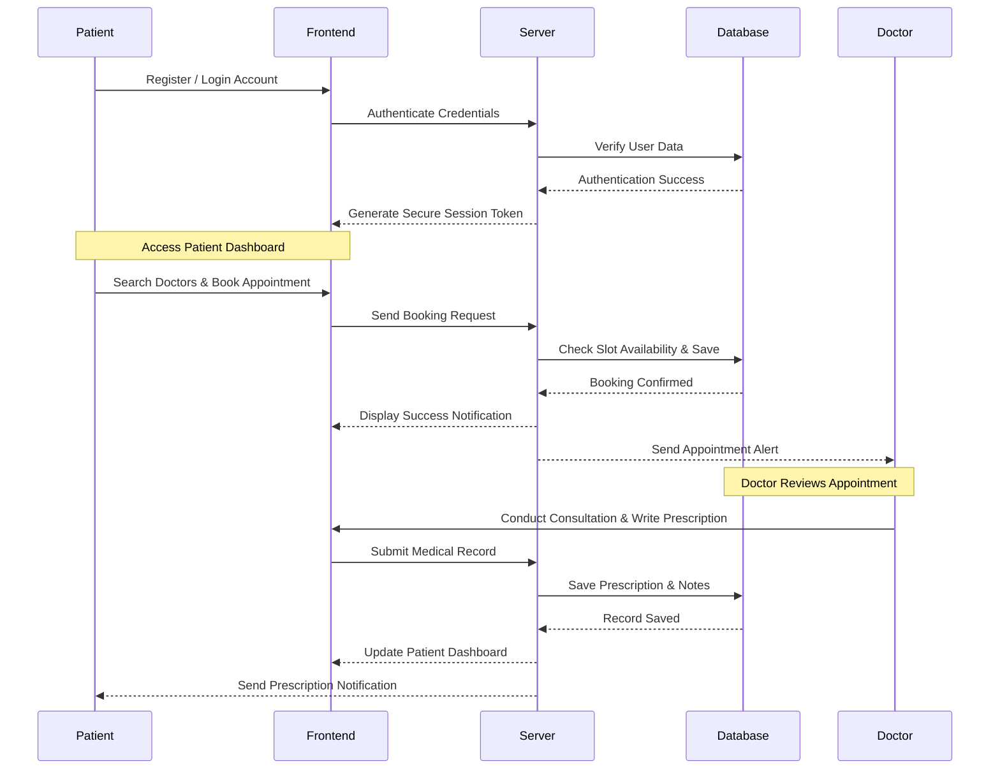

# FedCare: A Modern Digital Healthcare Platform

## 1. Project Overview

FedCare is a comprehensive, enterprise-grade digital healthcare platform designed to bridge the gap between patients, healthcare providers, and medical administrators. In today's fast-paced world, managing healthcare services manually through physical paperwork and phone calls is no longer efficient. FedCare solves this problem by providing a centralized digital ecosystem where all healthcare interactions can take place seamlessly and securely.

The platform was developed to address critical challenges in modern healthcare management, specifically focusing on patient health management, streamlined appointment scheduling, and the secure digitization of medical records. By bringing hospitals, clinics, and patients onto a single unified platform, FedCare significantly improves healthcare accessibility. Patients no longer need to wait in long queues to book an appointment or struggle to maintain their physical medical reports. Doctors can easily access a patient's complete medical history before a consultation, leading to better and more informed medical decisions.

From tracking patient health and monitoring ongoing treatments to managing hospital administration tasks, FedCare provides a robust solution. It serves as a modern digital health assistant, ensuring that medical records are always available when needed, appointments are managed without conflicts, and communication between doctors and patients is clear and effective. Ultimately, FedCare represents a significant step forward in how digital technology can be utilized to provide better, faster, and more reliable healthcare services.

## 2. Project Objectives

The primary objective of the FedCare platform is to simplify healthcare management by replacing outdated, manual processes with intelligent digital solutions. By achieving this, the platform aims to create a highly efficient, user-friendly environment for everyone involved in the healthcare journey.

Key objectives include:
- **Simplify Healthcare Management:** To provide administrators and hospital staff with a unified dashboard to manage schedules, doctors, and patient flow without confusion.
- **Improve Patient Experience:** To ensure that patients can easily find doctors, book appointments, and access their health records from the comfort of their homes.
- **Digitalize Medical Records:** To eliminate the risk of lost physical reports by storing all medical history, prescriptions, and test results securely in the cloud.
- **Enable Secure Appointments:** To create a conflict-free, reliable appointment booking system that syncs in real-time, preventing double bookings and reducing wait times.
- **Improve Doctor-Patient Communication:** To establish direct and clear channels for notifications, prescription sharing, and health updates.
- **Reduce Paperwork:** To transform clinical operations into a completely paperless workflow, saving time, reducing costs, and contributing to a greener environment.
- **Improve Healthcare Accessibility:** To ensure that quality healthcare services are just a few clicks away, regardless of the patient's geographical location.
- **Enhance Healthcare Efficiency:** To optimize the daily operations of clinics and hospitals, allowing medical professionals to focus more on patient care rather than administrative tasks.

## 3. Motivation

The inspiration behind FedCare stemmed from observing the daily struggles faced by patients and medical staff within traditional healthcare systems. In many clinics and hospitals, processes are still heavily reliant on physical files, manual appointment ledgers, and fragmented communication channels. These outdated methods often lead to long waiting times, misplaced medical records, scheduling conflicts, and ultimately, a stressful experience for patients who are already dealing with health issues.

Traditional healthcare systems suffer from inefficiencies that directly impact patient care. When a doctor cannot immediately access a patient's past medical history, the quality of the consultation can suffer. When patients have to travel to a clinic simply to book an appointment or collect a test result, it creates an unnecessary burden. These challenges highlighted the urgent need for a cohesive, digital solution.

Digital healthcare platforms improve efficiency and patient care by making information instantly accessible and actions easily executable. The motivation for FedCare was to harness modern web technologies to build a system that is as reliable as it is easy to use. Modern healthcare requires intelligent digital solutions because the volume of health data is increasing, and patients now expect the same level of digital convenience in healthcare that they experience in banking or retail. FedCare was built to meet these expectations, ensuring that technology serves as an enabler of health, rather than a barrier.

## 4. Key Features

FedCare is packed with a wide array of features designed to cater to the specific needs of patients, doctors, and administrators. Every feature was built with a focus on simplicity, security, and efficiency.

- **Patient Registration:** A smooth and straightforward onboarding process where patients can create their secure accounts, input basic health details, and set up their personal healthcare profile in minutes.
- **Secure Authentication:** Utilizes industry-standard security protocols to ensure that all user logins are protected. This guarantees that sensitive health data is only accessible to authorized individuals.
- **Doctor Dashboard:** A specialized interface for medical professionals to view their daily schedule, manage upcoming appointments, and access the medical histories of their patients at a glance.
- **Patient Dashboard:** A personalized space for patients where they can view upcoming appointments, track their health progress, and quickly access past medical reports and prescriptions.
- **Appointment Booking:** An intuitive calendar-based system that allows patients to select their preferred doctor, choose an available time slot, and instantly confirm their consultation without any manual intervention.
- **Medical Records:** A secure digital vault where all past diagnoses, lab reports, and treatment histories are stored chronologically, making it easy for both patients and doctors to track health over time.
- **Health Reports:** Automated generation of easy-to-read health summaries that help patients understand their medical status and allow doctors to make quick, informed decisions.
- **Prescription Management:** Doctors can write, save, and send digital prescriptions directly to the patient's dashboard, ensuring that medication details are clear, readable, and permanently saved.
- **Notifications:** Real-time alerts sent to users regarding appointment confirmations, upcoming consultation reminders, and updates on newly uploaded medical reports.
- **Search Doctors:** A robust search and filter tool that allows patients to find the right medical specialist based on department, availability, experience, and location.
- **User Profile:** Comprehensive profile management where users can update their contact information, emergency contacts, and basic health metrics like allergies or chronic conditions.
- **Responsive Dashboard:** The entire application is built to adapt seamlessly to any screen size, ensuring a perfect user experience whether accessed via a desktop computer, tablet, or mobile phone.
- **Admin Panel:** A powerful control center for hospital management to oversee all platform activities, manage user roles, onboard new doctors, and monitor system performance.
- **Role-Based Access Control:** Strict security measures that ensure patients, doctors, and admins only see the information and features relevant to their specific role, preventing unauthorized data access.
- **Modern User Interface:** A clean, visually appealing, and highly intuitive design that makes navigating complex healthcare tasks feel simple and effortless for users of all technical skill levels.

## 5. Technology Stack

FedCare is built using a modern, robust, and scalable technology stack to ensure high performance, security, and a seamless user experience. The selection of these technologies reflects enterprise-level software engineering standards.

| Technology | Purpose |
| :--- | :--- |
| **Frontend** | |
| React | Used to build a dynamic, interactive, and fast single-page application (SPA) for a seamless user experience. |
| TypeScript | Adds static typing to JavaScript, reducing bugs during development and ensuring highly reliable code. |
| Vite | Serves as the frontend build tool, providing incredibly fast development server start times and optimized production builds. |
| Tailwind CSS | Utilized for rapid, responsive, and consistent UI styling, ensuring the platform looks professional on all devices. |
| **Backend** | |
| Node.js | Provides a highly scalable, event-driven runtime environment for the backend server, capable of handling multiple concurrent requests. |
| Express.js | A minimal and flexible web application framework used to build robust REST APIs for handling frontend requests. |
| REST APIs | The architectural style used for communication between the frontend client and the backend server. |
| **Authentication** | |
| Firebase Authentication | Implemented to provide secure, out-of-the-box user login, registration, and password management. |
| JWT (JSON Web Tokens) | Used for maintaining secure, stateless sessions and verifying user identity for protected API routes. |
| **Database & Cloud** | |
| MongoDB | A flexible NoSQL database used to store complex, document-based healthcare data such as medical records and user profiles. |
| Firebase Firestore | Used for real-time data synchronization, particularly useful for instant notifications and chat features. |
| Cloudinary | Integrated for secure cloud storage and optimized delivery of user profile pictures and scanned medical documents. |
| **Version Control** | |
| Git & GitHub | Used for source code management, tracking changes, and facilitating seamless collaboration among the development team. |

Every technology was selected carefully. React and Vite provide the speed required for a modern application, while TypeScript ensures enterprise-grade reliability. Node.js and MongoDB offer the flexibility and scalability needed to handle large volumes of healthcare data. Firebase Authentication and JWT guarantee that this sensitive data remains strictly protected.

## 6. System Architecture

The architecture of FedCare follows a classic modern web application structure, designed for clear separation of concerns, scalability, and security. The system uses a client-server model where the frontend application communicates securely with a centralized backend API.

**Architecture Components Explained:**
1. **Frontend Application:** This is the visual interface built with React. It handles user inputs, displays data, and manages local state. It is the only component the user directly interacts with.
2. **Authentication Layer:** Before any data is requested, the system verifies the user's identity via Firebase and JWT, ensuring they have the correct permissions.
3. **Backend API Services:** Built with Node.js and Express, this acts as the brain of the operation. It receives requests, processes business logic (like checking if an appointment slot is free), and orchestrates data movement. It is divided into specific modules for appointments, records, and users to maintain clean code.
4. **Database & Cloud Storage:** The permanent storage layer. MongoDB holds structured data like patient details and appointment times, while Cloudinary stores actual files like X-rays or PDF reports securely in the cloud.

## 7. Project Workflow

The FedCare platform operates on a logical, step-by-step workflow designed to mirror a real-world healthcare journey, but with digital efficiency.

**Step-by-Step Workflow:**
1. **User Registration:** A new patient signs up, providing their basic details. The system securely hashes their password and creates a profile.
2. **Login:** The user logs in. The system verifies their identity and grants them access to the platform.
3. **Patient Dashboard:** The patient lands on their personal dashboard, viewing a summary of their health status and past visits.
4. **Book Appointment:** The patient browses available doctors, selects a convenient time slot, and confirms the booking. The system prevents double-booking automatically.
5. **Doctor Reviews Appointment:** The assigned doctor receives a notification and views the patient's details and medical history on their dashboard prior to the consultation.
6. **Medical Record Updated:** After the consultation, the doctor updates the patient's digital file with new observations and diagnoses.
7. **Prescription Generated:** The doctor creates a digital prescription which is instantly saved to the database.
8. **Patient Notification:** The patient receives an alert that their consultation is complete and their new prescription is ready to view and download on their dashboard.

## 8. Database Design

FedCare utilizes a structured, relational approach within a NoSQL environment (MongoDB) to manage complex healthcare data efficiently. The database is organized into distinct collections that are intelligently linked.

| Collection / Table | Purpose & Stored Data | Relationships |
| :--- | :--- | :--- |
| **Users / Patients** | Stores fundamental patient information (Name, Email, Password Hash, Contact details, Basic health metrics, Address). | Links to `Appointments` and `Medical Records` via User ID. |
| **Doctors** | Stores professional medical profiles (Name, Specialization, Experience, Consultation Fees, Available Time Slots, Ratings). | Links to `Appointments` and `Prescriptions` via Doctor ID. |
| **Appointments** | Manages the scheduling logistics (Date, Time, Status [Pending, Confirmed, Completed], Payment Status). | Acts as a bridge linking a specific `User ID` to a specific `Doctor ID`. |
| **Medical Records** | The digital health vault (Diagnosis notes, Allergies, Historical health conditions, Links to uploaded documents like X-rays). | Linked strictly to `User ID` to ensure privacy. |
| **Prescriptions** | Stores medication instructions (Medicine name, Dosage, Frequency, Duration, Additional notes). | Linked to `User ID`, `Doctor ID`, and the specific `Appointment ID`. |
| **Notifications** | Manages system alerts (Message content, Type [Alert, Reminder, System], Read Status, Timestamp). | Linked to `User ID` or `Doctor ID` depending on the recipient. |
| **Reports / Files** | Stores metadata for physical files (File URL from Cloudinary, File Type, Upload Date). | Linked to `Medical Records` or directly to `User ID`. |

This structured design ensures data integrity. For example, by linking an `Appointment` to both a `User` and a `Doctor`, the system can instantly pull the relevant details for both parties without duplicating data, ensuring the platform runs fast and remains highly organized.

## 9. Security Features

Security is the most critical aspect of any healthcare application. Since FedCare handles sensitive personal and medical data, it implements rigorous security measures at every layer of the application.

- **Authentication:** Utilizing Firebase and JWT ensures that only verified users can log into the system. Passwords are never stored in plain text.
- **Authorization & Role-Based Access:** The system strictly defines what each user type can do. A patient can only view their own records, a doctor can only view records of patients assigned to them, and administrators have system-wide control but cannot alter medical diagnoses.
- **Secure APIs:** All communication between the frontend and backend occurs over HTTPS. APIs require valid authorization tokens to respond, preventing unauthorized access from external sources.
- **Data Privacy:** Patient data is structured so that personally identifiable information (PII) is kept separate from general system analytics, maintaining patient confidentiality.
- **Encrypted Communication:** Data transmitted across the network is encrypted, ensuring that medical records cannot be intercepted during transfer.
- **Database Security:** The MongoDB instance is protected by strong access controls, firewalls, and IP whitelisting, meaning the database cannot be accessed directly from the public internet.

Security is non-negotiable in healthcare applications. A breach of medical data can lead to severe privacy violations and loss of trust. FedCare's multi-layered security approach ensures compliance with best practices for healthcare data protection, giving patients peace of mind that their digital health records are completely safe.

## 10. User Interface

The User Interface (UI) of FedCare was designed with a specific philosophy: to make complex healthcare tasks feel simple, intuitive, and stress-free. The design focuses heavily on a clean, professional aesthetic that instills trust.

- **Responsive Design:** The layout automatically adjusts to look perfect on a large hospital desktop monitor or a patient's small smartphone screen.
- **Accessibility:** High-contrast colors, clear typography, and logical button placements ensure the platform is usable for elderly or visually impaired patients.
- **Simple Navigation:** A highly organized sidebar and intuitive menus mean users are never more than a couple of clicks away from their desired action, whether booking a visit or viewing a report.
- **Clean Dashboard:** Dashboards are designed to prevent information overload. They highlight only the most critical information—like today's appointments or pending alerts—front and center.
- **Mobile Friendly:** Recognizing that most patients will access the platform on the go, the mobile experience is optimized for touch controls and fast loading.
- **User Experience (UX):** Subtle animations, clear error messages, and logical step-by-step forms (like the appointment booking process) guide the user smoothly through the platform.

A well-designed interface improves usability by reducing the learning curve. Doctors can manage their schedules faster, and patients, regardless of their technical expertise, can navigate their healthcare needs confidently.

## 11. Challenges Faced

Developing a comprehensive healthcare platform like FedCare presented several realistic technical and architectural challenges. Overcoming these was key to delivering a stable product.

- **Appointment Scheduling Conflicts:** 
  - *Challenge:* Ensuring two patients couldn't book the exact same time slot with the same doctor, especially when multiple users are booking simultaneously.
  - *Solution:* Implemented database-level locking and real-time validation checks during the booking transaction to guarantee slot availability before confirming.
- **Database Design for Healthcare:** 
  - *Challenge:* Structuring the database to handle complex relationships between patients, doctors, changing schedules, and historical records without slowing down the system.
  - *Solution:* Utilized MongoDB's document structure carefully, balancing embedded documents for fast reads (like user profiles) and referenced documents for scalable data (like thousands of appointment records).
- **State Management in React:** 
  - *Challenge:* Keeping user data, appointment statuses, and notifications synchronized across different components in the frontend without excessive API calls.
  - *Solution:* Implemented efficient global state management strategies and custom React hooks to cache data locally and update the UI instantly.
- **Healthcare Data Management & Security:** 
  - *Challenge:* Ensuring that strict role-based access was enforced flawlessly so no patient could ever see another patient's data.
  - *Solution:* Created robust middleware on the Express server that intercepts every request and rigorously verifies the user's role and ID against the requested data resource.
- **Performance Optimization:** 
  - *Challenge:* Loading heavy medical documents and extensive lists of doctors quickly on mobile devices.
  - *Solution:* Integrated Cloudinary for optimized image delivery and implemented pagination and lazy loading in the frontend, ensuring data is only fetched when the user scrolls to it.

## 12. Future Enhancements

While FedCare currently provides a robust digital healthcare foundation, there is immense potential for future growth. Implementing advanced features can transform the platform into a next-generation intelligent health ecosystem.

- **AI Health Assistant:** Integrating an AI chatbot that can answer basic health queries, guide patients to the correct specialist based on symptoms, and assist with platform navigation.
- **Telemedicine & Video Consultation:** Building in-app secure video calling to allow doctors to consult with patients remotely, expanding healthcare access beyond physical clinics.
- **Health Analytics Dashboard:** Providing patients with visual charts tracking their health metrics over time (e.g., blood pressure, weight, glucose levels) to promote proactive health management.
- **Medicine Reminder:** A push-notification system that alerts patients on their mobile devices when it is time to take their prescribed medication.
- **Wearable Device Integration:** Allowing the platform to sync data directly from smartwatches and fitness trackers to give doctors a real-time view of the patient's vitals.
- **Cloud Deployment & Scalability:** Migrating the infrastructure to a major cloud provider (like AWS or Google Cloud) using Docker and Kubernetes to support a massive, nationwide user base.
- **AI Disease Risk Analysis:** Utilizing machine learning models to analyze a patient's historical medical data and flag potential future health risks for early intervention.
- **Online Payments:** Integrating a secure payment gateway (like Stripe) to allow patients to pay consultation fees seamlessly at the time of booking.

These enhancements will continuously improve FedCare, making it more intelligent, convenient, and capable of providing superior digital healthcare services.

## 13. Learning Outcomes

The development of FedCare was a highly educational journey, bridging theoretical software engineering concepts with practical, real-world application building.

- **Full-Stack Development:** Mastered the complete process of building an application from the ground up, integrating the React frontend seamlessly with a Node.js backend.
- **Software Architecture:** Learned how to design scalable system architectures, modularizing backend code and structuring frontend components for maximum reusability.
- **Database Design:** Gained practical experience in designing NoSQL database schemas that handle complex relationships, prioritizing both data integrity and query speed.
- **Authentication Security:** Developed a deep understanding of securing web applications, specifically implementing JWT, password hashing, and role-based access control.
- **REST APIs:** Improved skills in designing clean, logical, and secure API endpoints that facilitate efficient communication between client and server.
- **Problem Solving:** Enhanced critical thinking by tackling complex logic problems, such as real-time appointment conflict resolution and efficient state management.
- **UI/UX Design:** Learned the importance of user-centric design, realizing that a beautiful, responsive, and accessible interface is just as important as the backend logic.
- **Healthcare Software Development:** Gained unique insights into the specific requirements of building software for the medical industry, particularly concerning data privacy and user trust.

Overall, this project significantly improved comprehensive software engineering skills, demonstrating the ability to take a complex real-world problem and deliver a polished, functional digital solution.

## 14. Conclusion

FedCare is a testament to how digital innovation can transform traditional industries. By successfully combining modern web technologies, secure data management, and user-friendly design, the platform offers a highly effective solution for digital healthcare management.

The project demonstrates a thorough understanding of full-stack software development. From designing a responsive frontend with React and Tailwind CSS, to building a robust backend with Node.js and Express, and ensuring enterprise-level security through MongoDB and JWT authentication, every aspect of the platform has been engineered with precision. It successfully digitizes critical processes like appointment scheduling and medical record management, making healthcare services more efficient and accessible for everyone.

Looking ahead, FedCare possesses the foundation to evolve into an even smarter platform. With the potential integration of AI assistants, telemedicine, and health analytics, the system is perfectly positioned to meet the future demands of the healthcare industry. Ultimately, FedCare proves that practical software engineering, when applied thoughtfully, can significantly improve the quality, accessibility, and management of modern healthcare.

---
*This document provides a comprehensive overview of the FedCare platform, detailing its architecture, features, and technical implementation for professional review.*
