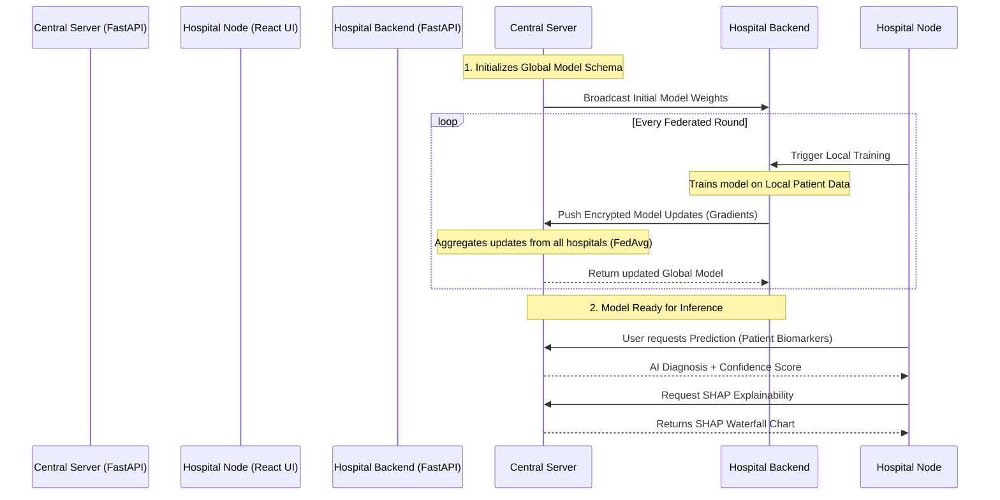

<div align="center">
  
  <h1>FedCare AI 🏥🤖</h1>
  <p><strong>A Privacy-Preserving Federated Learning Platform for Healthcare</strong></p>
</div>

FedCare AI is an advanced machine learning architecture that enables hospitals and medical facilities to collaboratively train AI models without ever sharing sensitive patient data. By utilizing **Federated Learning**, hospitals train models locally on their own servers and only share mathematical gradients/updates with the Central Server.

---

## 🚀 Deployed Links
- **Central Admin Portal (Frontend):** [Insert Frontend Link Here]
- **Central Coordinator API (Backend):** [Insert Backend Link Here]
- **Hospital Node Portal (Frontend):** [Insert Hospital Link Here]

*(Note: The Hospital nodes are typically run locally on-premise at the hospital facility).*

---

## ✨ Features
- **Data Privacy (Zero-Trust):** Patient data never leaves the hospital's local server.
- **Explainable AI (SHAP):** Transparent AI predictions with waterfall visualization showing exactly which biomarkers contributed to the diagnosis.
- **XGBoost & Logistic Regression Support:** Supports complex tree-based ensemble models via federated aggregation.
- **Role-Based Portals:** Dedicated web interfaces for Hospital Admins to manage training and Central Admins to monitor global model performance.

---

## 🔄 System Architecture & Workflow

The platform operates on a **Hub-and-Spoke** topology where the Central Server acts as the aggregator (Hub) and individual hospitals act as the clients (Spokes).



---

## 💻 Tech Stack
- **Frontend:** React, Vite, CSS Glassmorphism
- **Backend:** FastAPI (Python), SQLite, SQLAlchemy
- **Machine Learning:** Scikit-Learn, XGBoost, SHAP
- **Federated Engine:** Custom FedAvg Aggregator

---

## 🛠️ Getting Started (Local Development)

To run the full FedCare AI simulation locally, you need to spin up all 4 portals (2 backends, 2 frontends). 

### 1. Pre-requisites
Make sure you have Node.js and Python 3.10+ installed.

```bash
# Clone the repository
git clone https://github.com/Manvith-kumar16/FedCare-AI.git
cd FedCare-AI

# Create and activate a Python virtual environment
python -m venv .venv
```

### 2. Run the Servers

You will need to open **4 separate terminal windows**.

#### 🐧 Linux & macOS Commands

**Terminal 1: Central Backend**
```bash
source .venv/bin/activate
pip install -r central/backend/requirements.txt
cd central/backend
uvicorn app.main:app --port 8000
```

**Terminal 2: Central Admin Portal (Frontend)**
```bash
cd central/admin-portal
npm install
npm run dev # Runs on port 5173
```

**Terminal 3: Hospital Backend**
```bash
source .venv/bin/activate
pip install -r hospital/backend/requirements.txt
cd hospital/backend
uvicorn app.main:app --port 8001
```

**Terminal 4: Hospital Node Portal (Frontend)**
```bash
cd hospital/portal
npm install
npm run dev # Runs on port 5174
```

#### 🪟 Windows Commands (PowerShell)

**Terminal 1: Central Backend**
```powershell
.\.venv\Scripts\Activate.ps1
pip install -r central/backend/requirements.txt
cd central/backend
uvicorn app.main:app --port 8000
```

**Terminal 2: Central Admin Portal (Frontend)**
```powershell
cd central/admin-portal
npm install
npm run dev
```

**Terminal 3: Hospital Backend**
```powershell
.\.venv\Scripts\Activate.ps1
pip install -r hospital/backend/requirements.txt
cd hospital/backend
uvicorn app.main:app --port 8001
```

**Terminal 4: Hospital Node Portal (Frontend)**
```powershell
cd hospital/portal
npm install
npm run dev
```

---

## 🤝 Contributing
1. Fork the project
2. Create your feature branch (`git checkout -b feature/AmazingFeature`)
3. Commit your changes (`git commit -m 'Add some AmazingFeature'`)
4. Push to the branch (`git push origin feature/AmazingFeature`)
5. Open a Pull Request
