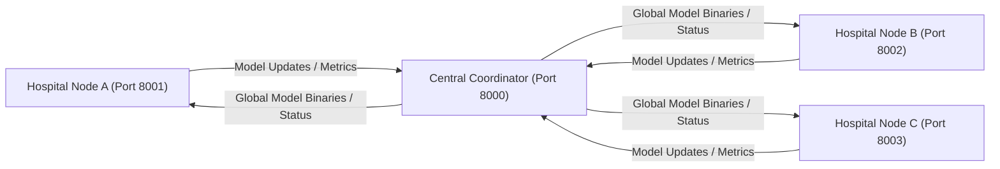
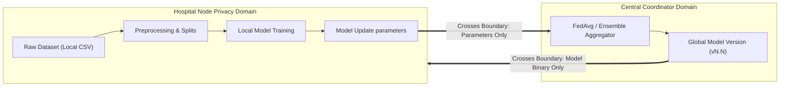

# FedCare-AI

## Explainable Federated Learning Framework for Privacy-Preserving Healthcare Systems

FedCare-AI is a privacy-preserving federated machine learning framework designed for collaborative clinical analytics. In traditional machine learning, multi-institutional research projects require centralizing raw patient datasets into a single database repository. This centralization creates significant hurdles due to patient confidentiality concerns, institutional data custody boundaries, and the risk of data leakage.

FedCare-AI solves this bottleneck by implementing a decoupled, two-portal federated learning architecture. Instead of pooling raw patient records, hospitals train models locally within their own secure environments. The local model weight updates are then transmitted to a central coordinator backend, which aggregates them into a global model. 

*Note: This platform is an academic research prototype and final-year project showcase. It is intended for local demonstration and evaluation purposes and is not a clinically validated, production-ready, HIPAA/GDPR-compliant system.*

---

## 📋 Table of Contents
1. [Overview](#fedcare-ai)
2. [Project Objectives](#project-objectives)
3. [Project Evolution](#project-evolution-and-improvements)
4. [Before vs After Comparison](#before-vs-after-comparison)
5. [Major Changes Implemented](#major-changes-implemented)
6. [System Architecture](#system-architecture)
7. [High-Level Architecture Diagram](#high-level-architecture-diagram)
8. [Multi-Hospital Architecture](#multi-hospital-architecture)
9. [Privacy Boundary Diagram](#privacy-boundary-diagram)
10. [End-to-End Federated Workflow](#end-to-end-federated-learning-workflow)
11. [Component Architecture](#component-architecture)
12. [Database Architecture](#database-architecture)
13. [Explainability Architecture](#explainability-architecture)
14. [Security Architecture](#security-architecture)
15. [Repository Structure](#repository-structure)
16. [Technology Stack](#technology-stack)
17. [Prerequisites](#prerequisites)
18. [Installation & Cloning](#installation--cloning)
19. [Python Environment Setup](#python-environment-setup)
20. [Environment Configuration](#environment-configuration)
21. [Database Setup](#database-setup)
22. [Running the Application](#running-the-application-locally)
23. [Expected Local URLs](#expected-local-urls)
24. [Development Demo Accounts](#development-demo-accounts)
25. [Demonstration Guide](#recommended-final-year-project-demonstration)
26. [API Documentation](#api-documentation)
27. [Testing and Verification](#testing-and-verification)
28. [Frontend Build Verification](#frontend-build-verification)
29. [Centralized vs Federated Research Experiment](#research-experiment-centralized-vs-federated-learning)
30. [Privacy Model](#privacy-model)
31. [Security Limitations](#security-limitations)
32. [Potential Research Contributions](#potential-research-contributions)
33. [Limitations](#limitations)
34. [Future Work](#future-work)
35. [Troubleshooting](#troubleshooting)
36. [Development Workflow](#development-workflow)
37. [Research Paper Relevance](#research-paper-relevance)

---

## 🎯 Project Objectives

* **Collaborative ML Training**: Allow independent clinical centers to train machine learning models collaboratively.
* **Raw Dataset Locality**: Keep raw CSV dataset files strictly within each hospital's local storage environment.
* **Separation of Responsibilities**: Separate coordinator aggregation routines from client dataset preprocessing and local training execution.
* **Central Research Management**: Provide a dashboard for research administrators to register hospital nodes, coordinate training rounds, and monitor global metrics.
* **Integrated Explainable AI (XAI)**: Enable patient-level SHAP explainability locally on the hospital node.
* **Centralized vs. Federated Baseline Comparison**: Provide comparative baseline tests evaluating model metric trade-offs.
* **Reproducible E2E Verification**: Build an automated test suite verifying security access boundaries, role isolation, and federated convergence.

---

## 🔄 Project Evolution and Improvements

Originally, the FedCare-AI project featured a monolithic architecture where a single frontend and backend managed both administrative actions and dataset handling. This structure presented several limitations:
* Raw patient datasets were uploaded directly to a centralized server.
* Hospital investigator credentials and administrator actions shared the same API database schemas.
* Portals were combined, risking boundary leakage.

To address these concerns, the architecture was redesigned to isolate hospital and administrator domains completely:
* Hospital portals communicate *only* with their respective local hospital backends.
* Hospital nodes run on isolated ports and access separate physical database instances.
* The Central backend acts as a coordinator, receiving only parameters, metric metadata, and sample counts.
* The original directories (`backend/` and `frontend/`) remain in the repository root solely as legacy references.

---

## 📊 Before vs After Comparison

| Aspect | Original Monolithic Project | Improved Decoupled Project |
| :--- | :--- | :--- |
| **Frontend** | Shared single React portal | Separate Central Admin and Hospital portals |
| **Backend** | Shared FastAPI backend | Separate Central Coordinator and Hospital Node backends |
| **Database** | Shared database schemas | Separate Central DB and local Hospital DBs |
| **Dataset Ingestion** | Raw CSV uploaded to coordinator | Raw CSV uploaded strictly to local hospital directories |
| **Training** | Centralized trigger execution | Explicit hospital-local training execution |
| **Model Management** | Unversioned global models | Global model versioning, tracking, and SHA-256 validation |
| **Explainability** | Shared SHAP calls | Local SHAP waterfall charts restricted to the hospital node |
| **Security** | Shared Auth tables | Strict JWT claims enforcing hospital ID validation and role isolation |
| **Experimentation** | Minimal comparative evaluations | Automated scripts comparing centralized vs. federated metrics |

---

## 🛠️ Major Changes Implemented

### 5.1 Two-Portal Architecture
* **Central Admin Portal (`central/admin-portal`)**: Used by researchers to start rounds and evaluate global accuracy, F1, and feature attribution charts.
* **Hospital Portal (`hospital/portal`)**: Used by local investigators to manage datasets, inspect metrics, trigger local training, and run diagnostic predictions.

### 5.2 Central Backend (`central/backend`)
Performs administrator authentication, tracks registered hospital nodes, manages disease servers, coordinates training rounds, performs model update weight validation, compiles aggregated parameters, and manages global model versions.

### 5.3 Hospital Backend (`hospital/backend`)
Authenticates local users, maintains local raw dataset files, validates data integrity, trains local XGBoost/LR estimators, hosts local SHAP engines, and pulls global models for local inference.

### 5.4 Separate Databases
* **Central Database (`central.db`)**: Stores tables for users (admin/coordinators), hospital registries, disease servers, rounds, global versions, and aggregated logs.
* **Hospital Database (`hospital.db`)**: Stores local users, dataset file paths, local training metrics, and prediction tables.

### 5.5 Privacy Boundary
The tested workflow ensures that **raw patient data remains within the hospital node and is not transferred to the central server**. The hospital backend processes raw datasets locally to generate parameters, and only these updates cross the boundary.

### 5.6 Federated Learning Pipelines
* **Federated XGBoost Ensemble**: Combines local `XGBClassifier` estimators into a `FederatedEnsembleClassifier` that computes a weighted average of class probabilities.
* **Federated Logistic Regression**: Averages local model coefficient matrices (`coef_`) and intercept vectors (`intercept_`) based on local sample counts (FedAvg).

### 5.7 Model Versioning
Rounds are tracked sequentially. Aggregated weights are saved on the central server with a SHA-256 hash. When a round finishes, hospital nodes fetch the new global binary, verifying its integrity metadata.

### 5.8 Explainable AI (XAI)
* **Local SHAP**: The hospital portal displays per-patient SHAP waterfall plots generated locally on the hospital backend, keeping input features private.
* **Global Importance**: The coordinator generates mean feature importance bar charts from aggregated weights to summarize global trends.

### 5.9 Security & Isolation
* **JWT Authorization**: Enforces role access (`ADMIN` vs. `HOSPITAL`).
* **Hospital Isolation**: Requests targeting hospital nodes are rejected if the caller's JWT hospital ID does not match the target node's ID.

---

## 🏗️ System Architecture

```
                            ┌──────────────────────────────────────────┐
                            │           Central Coordinator            │
                            │  ┌────────────────────────────────────┐  │
                            │  │ Central Admin Portal (React, v5173)│  │
                            │  └─────────────────┬──────────────────┘  │
                            │                    ▼                     │
                            │  ┌────────────────────────────────────┐  │
                            │  │   Central Backend (FastAPI, v8000) │  │
                            │  └─────────────────┬──────────────────┘  │
                            │                    ▼                     │
                            │  ┌────────────────────────────────────┐  │
                            │  │      Coordinator DB (SQLite)       │  │
                            │  └────────────────────────────────────┘  │
                            └────────────────────▲─────────────────────┘
                                                 │
                   ┌─────────────────────────────┴─────────────────────────────┐
                   │  1. Submit Update (Params)      2. Pull Global Model vN   │
                   ▼                                                           ▼
┌──────────────────────────────────────────┐               ┌──────────────────────────────────────────┐
│             Hospital Node A              │               │             Hospital Node B              │
│  ┌────────────────────────────────────┐  │               │  ┌────────────────────────────────────┐  │
│  │   Hospital Portal A (React, v5174) │  │               │  │   Hospital Portal B (React, v5175) │  │
│  └─────────────────┬──────────────────┘  │               │  └─────────────────┬──────────────────┘  │
│                    ▼                     │               │                    ▼                     │
│  ┌────────────────────────────────────┐  │               │  ┌────────────────────────────────────┐  │
│  │   Hospital Backend A (FastAPI, 8001)│  │               │  │   Hospital Backend B (FastAPI, 8002)│  │
│  └─────────┬──────────────────┬───────┘  │               │  └─────────┬──────────────────┬───────┘  │
│            ▼                  ▼          │               │            ▼                  ▼          │
│  ┌──────────────────┐ ┌──────────────┐   │               │  ┌──────────────────┐ ┌──────────────┐   │
│  │ Hospital DB A    │ │ Local CSV A  │   │               │  │ Hospital DB B    │ │ Local CSV B  │   │
│  └──────────────────┘ └──────────────┘   │               │  └──────────────────┘ └──────────────┘   │
└──────────────────────────────────────────┘               └──────────────────────────────────────────┘
```

---

## 🌐 Multi-Hospital Architecture

The coordinator handles scale by accepting additional hospital backend registrations.



---

## 🔒 Privacy Boundary Diagram



---

## 🔁 End-to-End Federated Learning Workflow

1. **Hospital User Authentication**: The investigator logs in to the Hospital Portal.
2. **Dataset Custody Ingestion**: The investigator uploads a local CSV dataset file, which is saved strictly within the hospital node directory.
3. **Dataset Validation & Preprocessing**: The Hospital Backend validates dataset schemas and runs local preprocessing.
4. **Local Model Training**: The Hospital Backend trains local XGBoost trees or Logistic Regression coefficients.
5. **Model Update Submission**: The Hospital Backend extracts model parameters and submits them to the Central Backend.
6. **Central Ingestion & Validation**: The Central Coordinator checks the submission schema and stores the update metadata.
7. **Federated Aggregation**: Once the required number of updates are received, the Central Coordinator aggregates them to generate the new global model version.
8. **Global Model Distribution**: The Coordinator publishes the aggregated model and its SHA-256 hash.
9. **Hospital Synchronization & Inference**: The Hospital Backend downloads the new model, executes local predictions on demand, and generates local SHAP explainability charts.

---

## 📦 Repository Structure

```text
FedCare-AI/
│
├── central/
│   ├── admin-portal/        # React/Vite admin dashboard client
│   │   ├── src/             # Pages: Login, Dashboard, Hospitals, Servers, Rounds, XAI
│   │   └── package.json     # Node configurations for Admin portal
│   └── backend/             # FastAPI coordinator backend
│       ├── app/             # Routers (auth, servers, rounds, federated), Models, Schemas
│       └── tests/           # Security, simulation, and experiment scripts
│
├── hospital/
│   ├── portal/              # React/Vite hospital investigator portal
│   │   ├── src/             # Pages: Datasets, Local Training, Predictions, Local SHAP
│   │   └── package.json     # Node configurations for Hospital portal
│   └── backend/             # FastAPI hospital backend
│       └── app/             # Routers (auth, datasets, training, prediction, sync), Core configs
│
├── docs/
│   └── architecture.md      # Detailed system architecture document
│
├── backend/                 # Legacy root backend (kept as reference)
├── frontend/                # Legacy root frontend (kept as reference)
│
├── .gitignore               # System-wide git ignore rules
└── README.md                # System documentation
```

---

## 💻 Technology Stack

* **Backend Services**: Python 3.12.10, FastAPI 0.115, SQLAlchemy 2.0, Uvicorn, SQLite database.
* **Machine Learning & XAI**: XGBoost 2.1, Scikit-learn 1.5, SHAP 0.46, Pandas, NumPy.
* **Frontends**: React 18, Vite 5.4, React Router v6, Chart.js.

---

## ⚙️ Prerequisites

Verify that these software packages are installed on your system before proceeding:
```text
Python v3.10 or higher (Tested on Python 3.12.10)
Node.js v18 or higher (Tested on Node.js v22.21.1)
npm Package Manager (Tested on npm 10.9.4)
```

---

## 🚀 Installation & Cloning

1. Clone the repository and navigate to the project directory:
   ```bash
   git clone https://github.com/Manvith-kumar16/FedCare-AI.git
   cd FedCare-AI
   ```
2. Switch to the active redesigned architecture branch:
   ```bash
   git checkout feature/two-portal-architecture
   ```

---

## 🐍 Python Environment Setup

Configure a virtual environment in the repository root:
```powershell
# Create virtual environment
python -m venv .venv

# Activate virtual environment on Windows PowerShell
.\.venv\Scripts\Activate.ps1
```

Install the backend dependencies:
```powershell
# Install Central Backend requirements
cd central/backend
pip install -r requirements.txt

# Install Hospital Backend requirements
cd ../../hospital/backend
pip install -r requirements.txt
```

---

## 📝 Environment Configuration

Create local `.env` files in both backend directories using the provided templates:

### A. Central Backend (`central/backend/.env`)
```ini
APP_NAME="FedCare AI Central Coordinator"
APP_VERSION="1.0.0"
DEBUG=True
DATABASE_URL="sqlite+aiosqlite:///./central.db"
SECRET_KEY="fedcare-ai-central-coordinator-super-secret-key-2026"
ALGORITHM="HS256"
ACCESS_TOKEN_EXPIRE_MINUTES=120
CORS_ORIGINS=["http://localhost:5173", "http://localhost:3000"]
```

### B. Hospital Backend (`hospital/backend/.env`)
```ini
APP_NAME="FedCare AI Hospital Node"
APP_VERSION="1.0.0"
DEBUG=True
DATABASE_URL="sqlite+aiosqlite:///./hospital.db"
SECRET_KEY="fedcare-ai-hospital-node-super-secret-key-2026"
ALGORITHM="HS256"
ACCESS_TOKEN_EXPIRE_MINUTES=120
HOSPITAL_ID=1
CENTRAL_API_URL="http://localhost:8000"
CORS_ORIGINS=["http://localhost:5174", "http://localhost:3000"]
```

---

## 💾 Database Setup

The FastAPI application automatically handles SQLite database initialization. On startup, tables and seed data (such as default admin accounts, preconfigured disease servers, and approved hospital credentials) are generated if the target `.db` files do not exist.

---

## 🏃 Running the Application Locally

To run the full system, start the four components in separate terminals:

| Terminal | Component | Directory | Command | URL |
| :---: | :--- | :--- | :--- | :--- |
| **1** | Central Backend | `central/backend` | `uvicorn app.main:app --port 8000` | http://127.0.0.1:8000 |
| **2** | Admin Portal | `central/admin-portal` | `npm run dev` | http://localhost:5173 |
| **3** | Hospital Backend | `hospital/backend` | `uvicorn app.main:app --port 8001` | http://127.0.0.1:8001 |
| **4** | Hospital Portal | `hospital/portal` | `npm run dev` | http://localhost:5174 |

---

## 🔗 Expected Local URLs

* **Central Coordinator APIs**: http://127.0.0.1:8000
* **Central Swagger Docs**: http://127.0.0.1:8000/docs
* **Admin Dashboard Portal**: http://localhost:5173
* **Hospital Backend Node APIs**: http://127.0.0.1:8001
* **Hospital Swagger Docs**: http://127.0.0.1:8001/docs
* **Hospital Portal Interface**: http://localhost:5174

---

## 🔑 Development Demo Accounts

The following test accounts are pre-seeded on startup:

* **Central Coordinator Admin**:
  * Email: `admin@fedcare.ai`
  * Password: `admin123`
* **Hospital Node Investigator**:
  * Email: `aj@gmail.com`
  * Password: `hospital123`

---

## 📖 Recommended Final-Year Project Demonstration

### Step 1 — Launch Services
Start the four terminals listed in the running guide. Verify that all startup logs report no port binding errors.

### Step 2 — Hospital Log In
Open http://localhost:5174, click **Login**, and log in with the investigator credentials (`aj@gmail.com` / `hospital123`).

### Step 3 — Data Management and Local Upload
Navigate to **Dataset Management**. Select your test medical CSV dataset file (e.g., sample Pima Indians Diabetes file). The system saves the file locally in your node's data subdirectory.

### Step 4 — Local Training Execution
Navigate to **Local Training**. Choose the target disease server (XGBoost or Logistic Regression) and click **Train Local Model**. Inspect the real-time logs and verify the local accuracy, precision, and F1 metrics.

### Step 5 — Submit Model Updates
Click **Synchronize with Central**. This extracts and transmits only your local model parameter updates and sample metrics to the Central Coordinator at port 8000.

### Step 6 — Administrator Coordinator Dashboard
Open http://localhost:5173, log in as `admin@fedcare.ai` / `admin123`. View the registered hospital registries and active servers.

### Step 7 — Run Aggregation
Under **Active Servers**, click **Run Aggregation**. Once the participating nodes have synced, the coordinator executes either XGBoost Ensemble pooling or Logistic Regression FedAvg coefficient averaging. The server publishes version `v0.1.0`.

### Step 8 — Hospital Node Diagnostics & Local SHAP
Return to the Hospital Portal (http://localhost:5174) under **Predictions**. Notice the updated global model version (`v0.1.0`). Submit custom diagnostic features into the prediction input form. The portal displays the classification outcome alongside local SHAP feature contribution waterfall charts.

---

## 📡 API Documentation

FastAPI automatically hosts interactive OpenAPI endpoints:

* **Central coordinator routes**:
  * `/api/v1/auth/login`: Issue administrator access tokens.
  * `/api/v1/hospitals/`: Register, list, and approve hospital client nodes.
  * `/api/v1/servers/`: Configure target disease servers and validation rules.
  * `/api/v1/federated/model-update`: Receive client updates and save metrics.
* **Hospital client routes**:
  * `/api/v1/datasets/upload`: Save raw datasets locally.
  * `/api/v1/training/train`: Trigger local training execution.
  * `/api/v1/predict/query`: Run diagnostic queries using the global model.
  * `/api/v1/predict/shap`: Generate SHAP waterfall charts.

---

## 🧪 Testing and Verification

Run the automated E2E security, privacy, and federated simulation test suite:
```powershell
$env:PYTHONPATH="central/backend;hospital/backend"
.venv/Scripts/python -u central/backend/tests/security_and_simulation_verify.py
```
This script launches coordinator and isolated client nodes on local ports to run 29 verification tests:
* Central coordinator health verification.
* Hospital node isolation and directory boundary checks.
* Role-based token locks (HOSPITAL users blocked from ADMIN endpoints).
* Central database patient-level table checks.
* XGBoost Ensemble and Logistic Regression FedAvg parameter updates.

---

## 📦 Frontend Build Verification

To confirm production build capabilities, compile both portals:
```powershell
# Build Admin Portal
cd central/admin-portal
npm install
npm run build

# Build Hospital Portal
cd ../../hospital/portal
npm install
npm run build
```
Verify that Vite finishes compilation, outputting assets to their respective `dist/` subdirectories.

---

## 🔬 Research Experiment: Centralized vs Federated Learning

The platform includes a reproducible comparison script to evaluate metrics against centralized baselines on **deterministic synthetic medical data**:
```powershell
$env:PYTHONPATH="central/backend;hospital/backend"
.venv/Scripts/python -u central/backend/tests/experiment_compare.py
```

### Experimental Setup
* **Hospital A Node**: 250 Train Samples
* **Hospital B Node**: 300 Train Samples
* **Holdout Validation Set**: 150 Samples
* **Split**: 80-20 Train/Test split across nodes.

### Metric Comparison Table

| Model Configuration | Accuracy | Precision | Recall | F1-Score | ROC AUC | Update Size* | Privacy Attribute Description |
| :--- | :---: | :---: | :---: | :---: | :---: | :---: | :--- |
| **Centralized XGBoost** | 66.67% | 67.92% | 52.17% | 59.02% | 0.7305 | 0.00 KB | Raw patient data is combined centrally. |
| **Federated XGBoost Ensemble** | 66.00% | 68.75% | 47.83% | 56.41% | 0.7472 | 132.14 KB | Raw patient data remains local. |
| **Centralized Logistic Regression** | 68.00% | 69.81% | 53.62% | 60.66% | 0.7393 | 0.00 KB | Raw patient data is combined centrally. |
| **Federated Logistic Regression** | 68.00% | 70.59% | 52.17% | 60.00% | 0.7364 | 0.47 KB | Raw patient data remains local. |

*\* Update size measurements represent estimated serialized model-update sizes for the experiment, not production network measurements.*

### Observations & Trade-offs
* Federated XGBoost Ensemble provides performance close to the centralized baseline (within 2.61% F1) and exhibits a slightly higher ROC AUC on this test set (0.7472 vs 0.7305) due to ensembling effects.
* Federated Logistic Regression with weighted FedAvg converges closely with its centralized counterpart (within 0.66% F1).
* The results demonstrate that the federated implementations function as privacy-oriented alternatives rather than universally superior models.

---

## 🔒 Privacy Model

### Data Retained at Hospital Node
* Raw patient CSV files.
* Local training sets.
* Local validation splits.
* Individual feature parameters entered for diagnostic queries.
* Preprocessing parameters.

### Information Transmitted to Central Coordinator
* Serialization bytes of estimators or parameters.
* Training sample count.
* Calculated metrics (Accuracy, F1, Loss).
* Target column schemas.

*The tested workflow is designed so that raw patient data remains within the hospital node and is not transferred to the central server.*

---

## ⚠️ Security Limitations

FedCare-AI is an academic research prototype. Users should note the following limitations:
* **No Secure Aggregation**: Local updates are sent in plaintext over standard HTTP in the local test setup. Production deployments should use TLS and cryptographic secure aggregation protocols (e.g., SMPC) to prevent model parameter reconstruction attacks.
* **No Differential Privacy**: The system does not implement Differential Privacy (DP) guarantees. The exchanged model weights remain vulnerable to membership inference under advanced adversarial threat models.
* **Prototype DB**: Access controls are implemented at the application layer. SQLite databases do not support enterprise-level row-level encryption by default.

---

## 🎓 Potential Research Contributions

* **Domain-Isolated Portals**: Demonstrates complete domain isolation for federated learning web applications, separating investigator portals from coordinator environments.
* **Ensemble XGBoost Aggregation**: Provides a technically valid approach for federated XGBoost ensembling that averages probability distributions rather than tree nodes, avoiding invalid parameter averaging.
* **Reproducible Test and Validation Framework**: Integrates E2E multi-port testing scripts alongside centralized baseline comparison frameworks on reproducible datasets.

---

## 🛑 Limitations

* **Synthetic Data**: Comparative evaluations utilize generated synthetic data.
* **Simulated Network Topology**: The E2E tests launch local processes using isolated ports rather than true geographically distributed systems.
* **XGBoost Update Payload Size**: The serialized XGBoost ensemble grows linearly with the number of rounds and participating hospitals, creating a network cost trade-off to maintain raw-data locality.

---

## 🔮 Future Work

* Integrate Secure Multiparty Computation (SMPC) to encrypt parameter payloads.
* Implement Differential Privacy (DP) noise additions on local parameters before submission.
* Containerize the platform using Docker Compose for cloud deployment.
* Incorporate tree pruning or compression to reduce the network payload size of XGBoost updates.

---

## 🔍 Troubleshooting

### Port Already in Use (e.g., WinError 10048)
If ports 8000, 8001, or 8002 are occupied on Windows, terminate the ghost processes:
```powershell
Get-Process | Where-Object {$_.ProcessName -like "*python*" -or $_.ProcessName -like "*uvicorn*"} | Stop-Process -Force
```

### Python Virtual Environment Activation Errors
If Windows prevents script execution, modify your execution policy:
```powershell
Set-ExecutionPolicy -ExecutionPolicy RemoteSigned -Scope Process
.\.venv\Scripts\Activate.ps1
```

### npm Installation Problems
Clear the package lock files and cache:
```bash
rm -rf node_modules package-lock.json
npm install
```

### CORS Import Violations
CORS origins are configured inside each backend's `.env` file. Ensure that the React dev server port (e.g., `http://localhost:5173`) is listed inside the `CORS_ORIGINS` array.

---

## 📈 Development Workflow

Always complete code changes on the active branch:
```bash
# Verify status
git status

# Ensure active feature branch
git checkout feature/two-portal-architecture
```
Keep changes focused on the feature branch. Do not commit or merge into `main` until the final project evaluation is complete.

---

## 📄 Research Paper Relevance

This repository provides reproducible experimental evidence and validation statistics for:
* **System Design**: See [docs/architecture.md](file:///d:/FedCare-AI/docs/architecture.md).
* **Comparative Baselines**: Run [experiment_compare.py](file:///d:/FedCare-AI/central/backend/tests/experiment_compare.py).
* **System Security**: Run [security_and_simulation_verify.py](file:///d:/FedCare-AI/central/backend/tests/security_and_simulation_verify.py).
