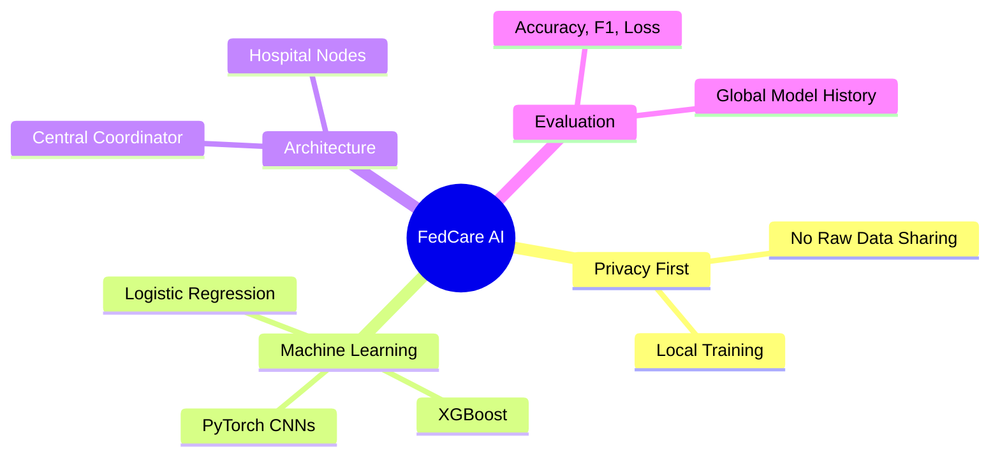
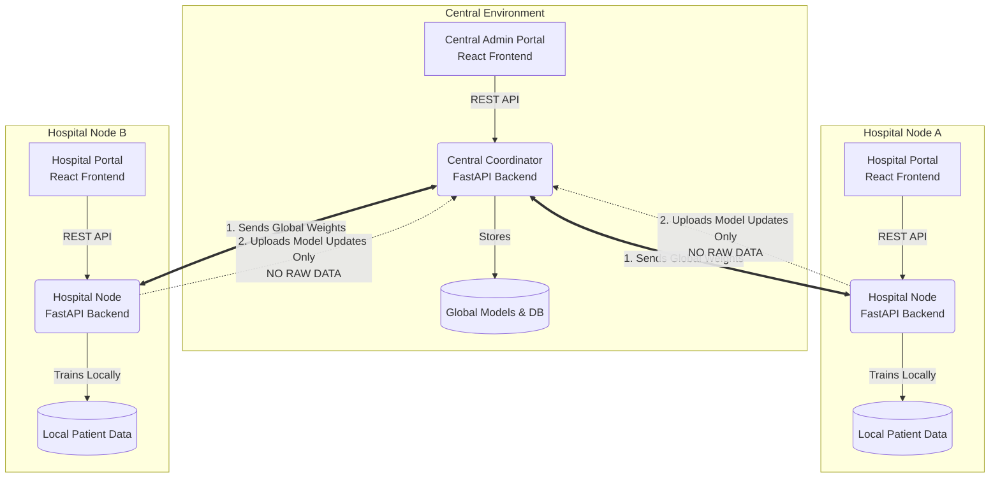

<div align="center">
  <h1>🏥 FedCare AI</h1>
  <p><b>Privacy-Preserving Federated Learning Platform for Healthcare</b></p>
  
  [](https://fedcare-central-portal.web.app)
</div>

<br>

## 🤔 What is Federated Learning? (In Simple Terms)
Imagine multiple hospitals want to collaborate to build a highly accurate AI for disease detection. Normally, they would have to pool all their sensitive patient records into one massive central database. But medical data is strictly private and cannot be shared!

**Federated Learning** solves this brilliantly:
1. Hospitals keep all their patient data safely locked on their own local servers.
2. An empty AI model is sent to each hospital.
3. The AI learns from the data locally at the hospital.
4. The AI only sends its *"knowledge"* (mathematical model weights/parameters) back to the central server.
5. The central server combines (aggregates) the knowledge from all hospitals into one super-smart global AI.

**Result:** A highly accurate, collaborative AI model is built **without a single patient record ever leaving its host hospital!**

---

## ✨ Features



- **Dual-Architecture Portals**: Dedicated interfaces for both Central Administrators and Hospital Nodes.
- **Multi-Modal AI**: Supports both **Tabular Data** (CSV/TXT for XGBoost & Logistic Regression) and **Image Datasets** (ZIP for PyTorch Convolutional Neural Networks).
- **Federated Averaging (FedAvg)**: Advanced mathematical aggregation of parameters to build robust global models.
- **Dataset Management**: Hospitals can securely upload and manage datasets entirely locally.
- **Real-Time Monitoring**: Stream real-time logs of the federated training loops and synchronization.

---

## 🏗️ Two-Portal Architecture

FedCare AI operates using a distributed system with two distinct types of portals:

1. **Central Coordinator (Admin Portal)**: Used by principal investigators to create new disease prediction pipelines, trigger training rounds, and aggregate the submitted knowledge.
2. **Hospital Node (Client Portal)**: Used by participating hospitals to link their local datasets, download global model seeds, train locally, and submit privacy-preserving model parameters.



---

## 💻 Tech Stack

| Category | Technologies Used |
|---|---|
| **Frontend** | React, Vite, CSS3, React Router |
| **Backend** | Python 3.10+, FastAPI, Uvicorn |
| **Database** | SQLite, SQLAlchemy (Async), Pydantic |
| **Machine Learning** | PyTorch (CNN), XGBoost, Scikit-learn, Pandas, NumPy |
| **Security** | JWT (JSON Web Tokens), OAuth2 |

---

## 🚀 Live Demo
You can view the deployed Central Coordinator portal here:  
👉 **[FedCare Central Portal](https://fedcare-central-portal.web.app)**

---

## 🛠️ Getting Started (Local Development)

To run the full FedCare AI simulation locally, you need to spin up all 4 portals (2 backends, 2 frontends). 

### 1. Pre-requisites
Make sure you have Node.js and Python 3.10+ installed.

```bash
# Clone the repository
git clone https://github.com/Manvith-kumar16/FedCare-AI.git
cd FedCare-AI

# Create and activate a Python virtual environment
python -m venv .venv
```

### 2. Run the Servers

You will need to open **4 separate terminal windows**.

#### 🐧 Linux & macOS Commands

**Terminal 1: Central Backend**
```bash
source .venv/bin/activate
pip install -r central/backend/requirements.txt
cd central/backend
uvicorn app.main:app --port 8000
```

**Terminal 2: Central Admin Portal (Frontend)**
```bash
cd central/admin-portal
npm install
npm run dev # Runs on port 5173
```

**Terminal 3: Hospital Backend**
```bash
source .venv/bin/activate
pip install -r hospital/backend/requirements.txt
cd hospital/backend
uvicorn app.main:app --port 8001
```

**Terminal 4: Hospital Node Portal (Frontend)**
```bash
cd hospital/portal
npm install
npm run dev # Runs on port 5174
```

#### 🪟 Windows Commands (PowerShell)

**Terminal 1: Central Backend**
```powershell
.\.venv\Scripts\Activate.ps1
pip install -r central/backend/requirements.txt
cd central/backend
uvicorn app.main:app --port 8000
```

**Terminal 2: Central Admin Portal (Frontend)**
```powershell
cd central/admin-portal
npm install
npm run dev
```

**Terminal 3: Hospital Backend**
```powershell
.\.venv\Scripts\Activate.ps1
pip install -r hospital/backend/requirements.txt
cd hospital/backend
uvicorn app.main:app --port 8001
```

**Terminal 4: Hospital Node Portal (Frontend)**
```powershell
cd hospital/portal
npm install
npm run dev
```

---

## 🤝 Contributing
1. Fork the project
2. Create your feature branch (`git checkout -b feature/AmazingFeature`)
3. Commit your changes (`git commit -m 'Add some AmazingFeature'`)
4. Push to the branch (`git push origin feature/AmazingFeature`)
