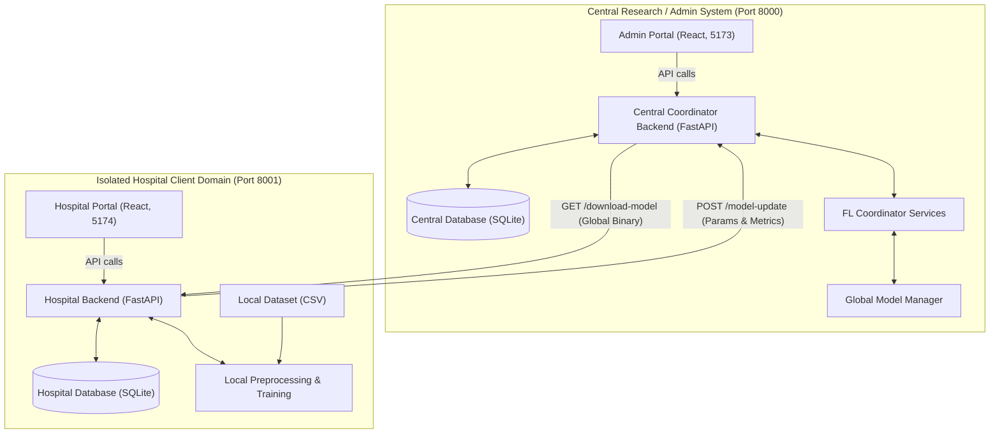
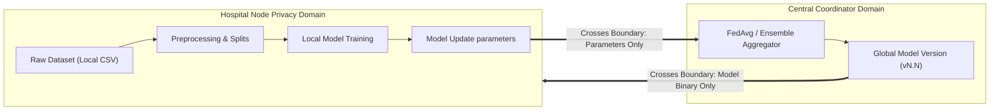
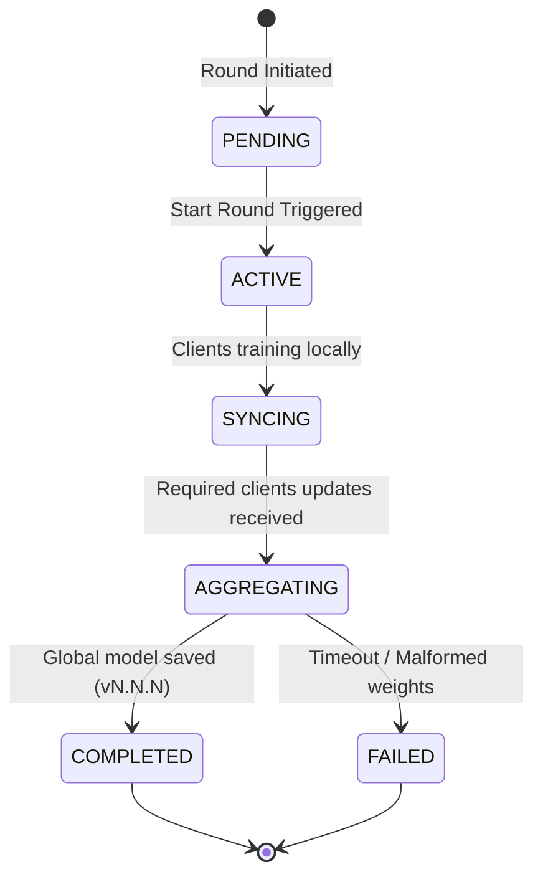
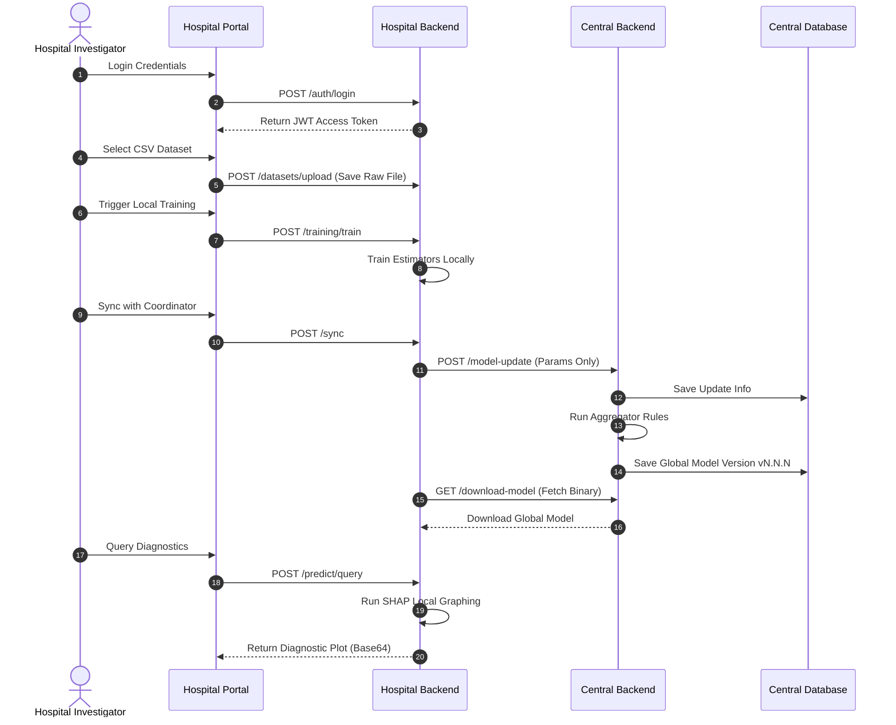

# FedCare-AI Technical Architecture and Developer Guide

This document serves as the technical map of the FedCare-AI codebase and onboarding guide for developers joining the team. It describes the decoupled two-portal architecture, domain boundaries, federated learning service layers, database separation, API layers, and testing protocols.

---

## 📋 Table of Contents
1. [Document Purpose](#1-document-purpose)
2. [System Overview](#2-system-overview)
3. [Core Architectural Principle](#3-core-architectural-principle)
4. [High-Level Architecture Diagram](#4-high-level-architecture-diagram)
5. [Two-Portal Architecture](#5-two-portal-architecture)
6. [Central Backend Architecture](#6-central-backend-architecture)
7. [Hospital Backend Architecture](#7-hospital-backend-architecture)
8. [Central ↔ Hospital Communication](#8-central--hospital-communication)
9. [API Architecture](#9-api-architecture)
10. [Database Architecture](#10-database-architecture)
11. [Data Ownership Model](#11-data-ownership-model)
12. [Privacy Boundary](#12-privacy-boundary)
13. [Federated Learning Aggregation](#13-federated-learning-aggregation)
14. [Model Versioning and Integrity](#14-model-versioning-and-integrity)
15. [Explainable AI Architecture](#15-explainable-ai-architecture)
16. [Security and Isolation Model](#16-security-and-isolation-model)
17. [Frontend Architecture Layout](#17-frontend-architecture-layout)
18. [Backend Request Execution Flow](#18-backend-request-execution-flow)
19. [Developer Modification Guide](#19-developer-modification-guide)
20. [Adding Another Hospital Node](#20-adding-another-hospital-node)
21. [Training Round State Machine](#21-training-round-state-machine)
22. [Error Handling and Logging](#22-error-handling-and-logging)
23. [Testing Architecture](#23-testing-architecture)
24. [Centralized vs Federated Experiment metrics](#24-centralized-vs-federated-experiment-metrics)
25. [Architectural Decisions and Rationale](#25-architectural-decisions-and-rationale)
26. [Legacy / Original Architecture](#26-legacy--original-architecture)
27. [Running the System (Ports Mapping)](#27-running-the-system-ports-mapping)
28. [System-Wide Sequence Diagram](#28-system-wide-sequence-diagram)
29. [Research Context & Limitations](#29-research-context--limitations)
30. [Future Extensions](#30-future-extensions)
31. [Team Development Workflow](#31-team-development-workflow)
32. [Quick Navigation Guide](#32-quick-navigation-guide)

---

## 1. Document Purpose

This document provides a detailed technical overview of the FedCare-AI codebase. Teammates can read this guide to understand:
* **README.md** handles high-level project summaries, local installation commands, and demonstration scripts.
* **docs/architecture.md** documents the internal code structure, class interfaces, database schemas, and code path maps.

---

## 2. System Overview

FedCare-AI is divided into two distinct domains:

### A. Central Research / Admin Domain
* **Admin Portal**: React interface for administrative control.
* **Central Backend**: FastAPI service coordinating rounds and aggregation.
* **Central Coordinator Database**: Stores logs, hospital metadata, and servers config.

### B. Hospital Domain
* **Hospital Portal**: React interface for local investigators.
* **Hospital Backend**: FastAPI service handling local training and SHAP.
* **Hospital local Database**: Stores local datasets paths, history, and predictions.

---

## 3. Core Architectural Principle

> The tested workflow is designed so that raw patient data remains within the hospital node and is not transferred to the central server.

This decouples **Data Ownership** from **Federated Coordination**. Hospital nodes retain physical custody of their raw patient data and perform preprocessing and training locally. Only aggregated metrics and parameters cross the boundary, reducing the need to centralize raw data.

---

## 4. High-Level Architecture Diagram



---

## 5. Two-Portal Architecture

### Central Admin Portal (`central/admin-portal/src/pages/`)
* `Login.jsx`: Administrator credentials authorization.
* `Dashboard.jsx`: Overall metrics, server registration counts, and node map.
* `Hospitals.jsx`: Displays registered, approved, or pending hospital nodes.
* `Servers.jsx` & `ServerDetail.jsx`: Disease server setup, configuration, and round control.
* `Rounds.jsx`: Monitors active training round steps.
* `Models.jsx`: Lists generated global model versions and hashes.
* `Metrics.jsx`: Evaluates loss/accuracy curves.
* `Explainability.jsx`: Renders global feature attribution plots.
* `TrainingHistory.jsx`: Training log audits.
* `Profile.jsx`: Admin user profile settings.

### Hospital Portal (`hospital/portal/src/pages/`)
* `Login.jsx`: Local investigator auth.
* `Dashboard.jsx`: Node metrics summary.
* `Datasets.jsx`: Local CSV file management.
* `DatasetValidation.jsx`: Implements type check and validation rules.
* `LocalTraining.jsx`: Executes local model fit runs.
* `FederatedTraining.jsx`: Syncs model parameters with active rounds.
* `Predictions.jsx`: Runs diagnostic queries.
* `Explainability.jsx`: Renders local SHAP waterfall charts.
* `Servers.jsx` & `ServerDetail.jsx`: Manages memberships.
* `Training.jsx`: Aggregated training execution dashboard.
* `Profile.jsx`: Local investigator profile settings.

---

## 6. Central Backend Architecture

### Directory Tree Layout
```text
central/backend/
└── app/
    ├── api/v1/endpoints/   # Router endpoints (auth, servers, rounds, federated)
    ├── core/               # Configuration settings, CORS, and JWT security keys
    ├── db/                 # Database initialization, session maker, and seeds
    ├── models/             # SQLAlchemy database model classes
    ├── schemas/            # Pydantic schemas for request validation
    └── services/           # Aggregation algorithms (fl_coordinator.py)
```

### Models (`central/backend/app/models/`)
* `User`: Admin accounts table.
* `Hospital`: Registry metadata.
* `DiseaseServer`: Configured target criteria and algorithm details.
* `ServerMember`: Approved hospital membership records.
* `TrainingRound`: Start and end logs for active rounds.
* `ModelUpdate`: Exchanged client parameters and sample counts.
* `ModelVersion`: Global model path and cryptographic SHA-256 validation.
* `TrainingLog`: Performance logs for tracking metrics.

---

## 7. Hospital Backend Architecture

### Directory Tree Layout
```text
hospital/backend/
└── app/
    ├── api/v1/endpoints/   # Routers for datasets, local training, prediction, and sync
    ├── core/               # Environment paths config (DATA_DIR, MODELS_DIR)
    ├── db/                 # Database session and local migration setup
    ├── models/             # Isolated SQLAlchemy models (Dataset, Prediction, TrainingHistory)
    ├── schemas/            # Request/Response validation schemas
    └── services/           # Services (ai_service, fl_client, xai_service)
```

### Services
* `fl_client.py`: Synchronizes round requests and downloads model binaries.
* `ai_service.py`: Fits local XGBoost/LR estimators and runs inference.
* `xai_service.py`: Computes local patient-level SHAP values and output charts.

---

## 8. Central ↔ Hospital Communication

```text
+-----------------------+              +---------------------------+
| Hospital Backend Node |              | Central Coordinator Node  |
|                       |              |                           |
|  - Sync Request       |              |                           |
|  - Model Params / Tree|=============>|  - Authenticate Client    |
|  - Sample Sizes       |  HTTP POST   |  - Parse Weights Update   |
|  - Evaluation Metrics |              |  - Run Aggregator Rules   |
|                       |              |                           |
|  - Get Global Model   |<=============|  - Update Round Status    |
|  - Hash Integrity     |  HTTP GET    |  - Version Binary Output  |
+-----------------------+              +---------------------------+
```

---

## 9. API Architecture

### Central Coordinator APIs (Port 8000)

| Endpoint | Method | Purpose | Authentication |
| :--- | :--- | :--- | :--- |
| `/api/v1/auth/login` | `POST` | Authenticate users and return JWT. | Public |
| `/api/v1/hospitals/` | `POST` | Register a new hospital node. | Public |
| `/api/v1/hospitals/` | `GET` | List all registered hospital nodes. | Admin JWT |
| `/api/v1/servers/` | `POST` | Create a new federated disease server. | Admin JWT |
| `/api/v1/federated/model-update` | `POST` | Submit local model update. | Hospital JWT |
| `/api/v1/training/rounds` | `POST` | Start a new training round. | Admin JWT |
| `/api/v1/health` | `GET` | Return central backend health status. | Public |

### Hospital Backend APIs (Port 8001)

| Endpoint | Method | Purpose | Authentication |
| :--- | :--- | :--- | :--- |
| `/api/v1/auth/login` | `POST` | Authenticate local investigator. | Public |
| `/api/v1/datasets/upload` | `POST` | Save raw CSV file locally. | User JWT |
| `/api/v1/training/train` | `POST` | Trigger local model training. | User JWT |
| `/api/v1/predict/query` | `POST` | Run inference using the global model. | User JWT |
| `/api/v1/predict/shap` | `POST` | Generate patient SHAP charts. | User JWT |
| `/api/v1/health` | `GET` | Return hospital backend health. | Public |

---

## 10. Database Architecture

```text
┌──────────────────────────────────────┐        ┌──────────────────────────────────────┐
│           Central Database           │        │          Hospital Database           │
├──────────────────────────────────────┤        ├──────────────────────────────────────┤
│ - Users (Admin credentials)          │        │ - Users (Local investigators)        │
│ - Hospitals (Approved node metadata)  │        │ - Datasets (Metadata / file paths)   │
│ - DiseaseServers (Feature schemas)   │        │ - TrainingHistory (Local runs logs)  │
│ - ServerMembers (Approved connections)│        │ - Predictions (Inputs / local SHAP)  │
│ - TrainingRounds (Active round states)│        └──────────────────────────────────────┘
│ - ModelUpdates (Client update metadata)│
│ - ModelVersions (Global model hashes)│
└──────────────────────────────────────┘
```

---

## 11. Data Ownership Model

| Information | Hospital Side | Central Side |
| :--- | :---: | :---: |
| **Raw Patient CSV records** | Yes (local directory only) | No |
| **Patient-level prediction features** | Yes (in memory only) | No |
| **Local train/test datasets** | Yes (local directory only) | No |
| **Model updates parameters** | Generated locally | Received for aggregation |
| **Sample counts** | Generated locally | Received for weighting |
| **Global model binaries** | Received and stored | Maintained and served |
| **Validation metrics** | Generated locally | Used for monitoring |

---

## 12. Privacy Boundary



### Boundary Limits
* Model update updates could theoretically leak training details to adversaries under model reconstruction attacks.
* Federated learning does not guarantee secure aggregation or differential privacy unless additional protections are integrated.

---

## 13. Federated Learning Aggregation

### A. Federated XGBoost Ensemble
Participating hospital nodes train independent `XGBClassifier` models. The central server compiles these models into a `FederatedEnsembleClassifier` that computes a weighted average of class probabilities:
```python
class FederatedEnsembleClassifier:
    def predict_proba(self, X) -> np.ndarray:
        probas = [model.predict_proba(X) for model in self.models]
        weighted_probas = np.zeros_like(probas[0])
        for p, w in zip(probas, self.weights):
            weighted_probas += p * w
        return weighted_probas
```
This aggregates predictions via ensemble voting, rather than attempting to average tree parameters directly (which is mathematically invalid).

### B. Federated Logistic Regression with Weighted FedAvg
Participating hospital nodes train local `LogisticRegression` models. The central coordinator averages their coefficient matrices and intercepts, weighted by the sample size of each hospital's local training split:
\[
W_{global} = \frac{n_A W_A + n_B W_B}{n_A + n_B}
\]

---

## 14. Model Versioning and Integrity

Global model versioning tracking prevents model poisoning and ensures consistency:
1. **Round Initialization**: The coordinator launches a round and saves version tracking metadata.
2. **Model Hashing**: Model binary weights are hashed using SHA-256 before saving to the database.
3. **Download Verification**: When a client node pulls the global model, it validates the SHA-256 integrity hash against the coordinator's database metadata before loading it into memory.

---

## 15. Explainable AI Architecture

### Hospital Node Local Explainability
To protect patient privacy, individual predictions are explained using local SHAP waterfall plots on the hospital node. The hospital backend processes the query features locally:
```text
Patient Query Features ──► Global Model ──► Prediction ──► SHAP Explainer ──► Waterfall Plot (Base64)
```

### Coordinator Global Explainability
The central server handles global explainability by plotting feature importance rankings from the aggregated model parameters. No patient records are analyzed centrally.

---

## 16. Security and Isolation Model

* **JWT Credentials Access**: All API routers are protected by JWT middleware verifying role scopes (`ADMIN` or `HOSPITAL`).
* **Hospital Identity Verification**: The Hospital node checks incoming investigator JWT claims to block cross-node dataset queries.
* **Update Verification**: Submissions lacking valid binary weight files are rejected with `HTTP 422 Unprocessable Entity` responses.

---

## 17. Frontend Architecture Layout

```text
*/portal/ or */admin-portal/
├── src/
│   ├── api/             # Axiom wrapper configurations making API calls
│   ├── components/      # Common UI components (Glassmorphism layout, graphs)
│   ├── context/         # AuthContext storing JWT logins
│   └── pages/           # Portal page components
├── vite.config.js       # Vite build setup
└── package.json         # Node packages configuration
```

---

## 18. Backend Request Execution Flow

```text
React Portal  ──► API Client (Axios)  ──► FastAPI Router  ──► Auth / JWT Middleware
                                                                      │
                                                                      ▼
React Portal  ◄── JSON Schema Response ◄── Service Logic  ◄── Endpoint Function
```

---

## 19. Developer Modification Guide

| If you want to change... | Go to... |
| :--- | :--- |
| **Admin Dashboard UI** | `central/admin-portal/src/pages/Dashboard.jsx` |
| **Hospital Local Datasets UI** | `hospital/portal/src/pages/Datasets.jsx` |
| **Central API Route** | `central/backend/app/api/v1/endpoints/` |
| **Hospital API Route** | `hospital/backend/app/api/v1/endpoints/` |
| **Central Database Model** | `central/backend/app/models/` |
| **Hospital Database Model** | `hospital/backend/app/models/` |
| **Central Aggregator Rules** | `central/backend/app/services/fl_coordinator.py` |
| **Local Model Training Logic** | `hospital/backend/app/services/ai_service.py` |
| **SHAP Graph Generation** | `hospital/backend/app/services/xai_service.py` |
| **Federated Client Sync** | `hospital/backend/app/services/fl_client.py` |
| **Database Schema Seeding** | `central/backend/app/db/` & `hospital/backend/app/db/` |

---

## 20. Adding Another Hospital Node

To add a new hospital node to the federated network:
1. **Register**: Register the node on the Central Coordinator.
2. **Authorize**: Approve the node under the admin portal (**Hospitals** page) to create its approved identifier credentials.
3. **Configure**: Start a new hospital backend service, setting unique environment variables:
   ```bash
   $env:HOSPITAL_ID="3"
   $env:DATABASE_URL="sqlite:///hospital_c.db"
   $env:DATA_DIR="data_c"
   $env:MODELS_DIR="saved_models_c"
   ```

---

## 21. Training Round State Machine



---

## 22. Error Handling and Logging

* **Logger Middleware**: Custom logger middleware intercepts incoming API requests to capture latency and logs.
* **HTTP Exceptions**: Handled via standard FastAPI `HTTPException` rules, returning structured JSON error details.
* **Training Exceptions**: Training errors are captured and written to local database execution logs to prevent server crashes.

---

## 23. Testing Architecture

E2E verification is managed by [security_and_simulation_verify.py](file:///d:/FedCare-AI/central/backend/tests/security_and_simulation_verify.py).
Run the verification suite:
```powershell
$env:PYTHONPATH="central/backend;hospital/backend"
.venv/Scripts/python -u central/backend/tests/security_and_simulation_verify.py
```
This runs 29 test checks verifying central coordinator health, hospital database separation, cross-node query blockings, role isolation, and XGBoost/LR round aggregations.

---

## 24. Centralized vs Federated Experiment Metrics

Baseline evaluations compare pooled datasets directly against isolated federated networks:
* **Hospital A Node**: 250 Train Samples
* **Hospital B Node**: 300 Train Samples
* **Holdout Validation Set**: 150 Samples

| Model Configuration | Accuracy | Precision | Recall | F1-Score | ROC AUC | Update Size* |
| :--- | :---: | :---: | :---: | :---: | :---: | :---: |
| **Centralized XGBoost** | 66.67% | 67.92% | 52.17% | 59.02% | 0.7305 | 0.00 KB |
| **Federated XGBoost Ensemble** | 66.00% | 68.75% | 47.83% | 56.41% | 0.7472 | 132.14 KB |
| **Centralized Logistic Regression** | 68.00% | 69.81% | 53.62% | 60.66% | 0.7393 | 0.00 KB |
| **Federated Logistic Regression** | 68.00% | 70.59% | 52.17% | 60.00% | 0.7364 | 0.47 KB |

*\* Update size measurements represent estimated serialized model-update sizes for the experiment, not production network measurements.*

---

## 25. Architectural Decisions and Rationale

* **Two Portals**: Isolates investigator and coordinator domains.
* **Separate Backends**: Establishes strict data ownership boundaries.
* **SQLite Separation**: Avoids central patient table records.
* **XGBoost Probability Ensembling**: Aggregates models without direct tree parameter averaging.

---

## 26. Legacy / Original Architecture

The legacy directories (`backend/` and `frontend/`) remain in the repository root solely as reference implementations. They are not used in the current decoupled two-portal architecture.

---

## 27. Running the System (Ports Mapping)

```text
┌──────────────────────────────────────┐
│  Central Coordinator Backend: 8000   │
├──────────────────────────────────────┤
│  Central Admin Portal: 5173          │
├──────────────────────────────────────┤
│  Hospital Backend Node A: 8001       │
├──────────────────────────────────────┤
│  Hospital Portal Client A: 5174      │
├──────────────────────────────────────┤
│  Hospital Backend Node B: 8002       │
└──────────────────────────────────────┘
```

---

## 28. System-Wide Sequence Diagram



---

## 29. Research Context & Limitations

* **Simulated Environment**: Nodes run locally on isolated ports rather than distinct geological servers.
* **Differential Privacy**: Exchanged model parameters do not include DP noise additions.
* **Ensemble Size**: Serialized model updates scale linearly with round count.

---

## 30. Future Extensions

* Differential Privacy noise bounds.
* Secure Aggregation protocols (SMPC).
* Model update compression.

---

## 31. Team Development Workflow

```text
Pull active branch (feature/two-portal-architecture) 
       ▼
Create local task branch 
       ▼
Modify source files 
       ▼
Run verification tests
       ▼
Run portal production builds
       ▼
Submit Pull Request
```

---

## 32. Quick Navigation Guide

* **Project Overview**: [README.md](file:///d:/FedCare-AI/README.md)
* **Architecture Docs**: [docs/architecture.md](file:///d:/FedCare-AI/docs/architecture.md)
* **Admin Portal UI**: [central/admin-portal/](file:///d:/FedCare-AI/central/admin-portal/)
* **Hospital Portal UI**: [hospital/portal/](file:///d:/FedCare-AI/hospital/portal/)
* **Central backend logic**: [central/backend/](file:///d:/FedCare-AI/central/backend/)
* **Hospital backend logic**: [hospital/backend/](file:///d:/FedCare-AI/hospital/backend/)
* **Verification suite**: [central/backend/tests/](file:///d:/FedCare-AI/central/backend/tests/)
